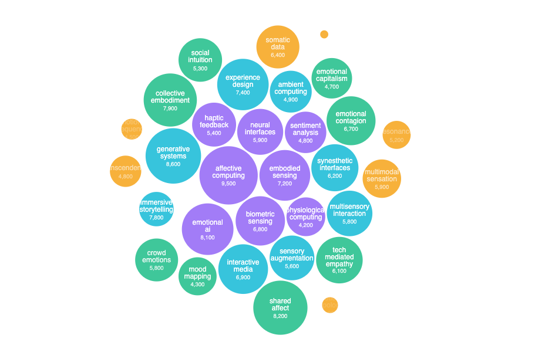
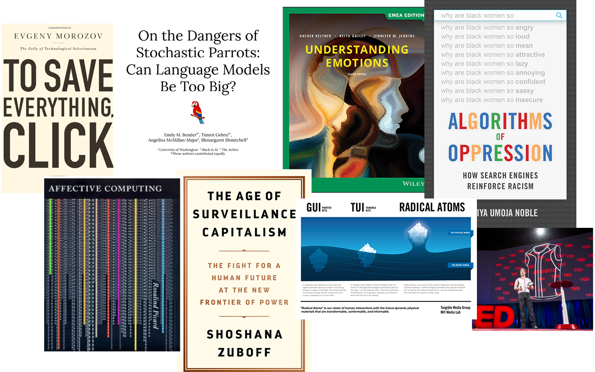
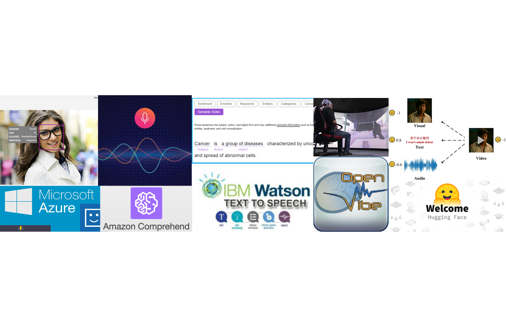
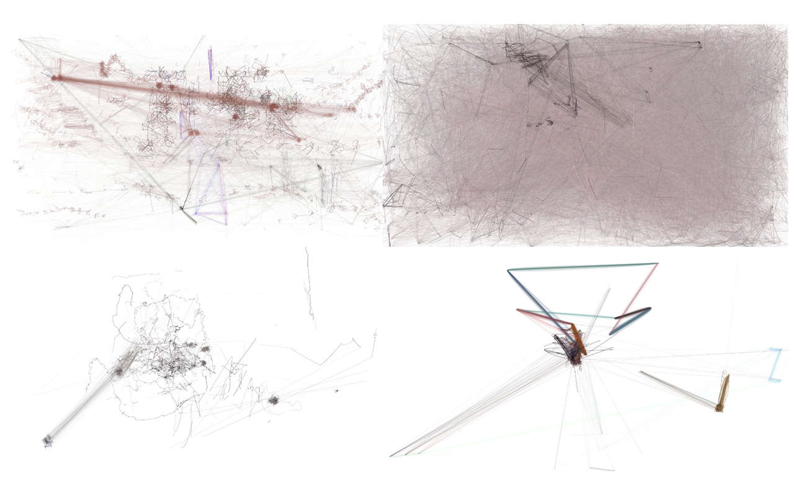

# Vulnerable Connections
[background:emo.png]
Vulnerable Connections: Technology, Emotion, and Collective Experience

===

# Keywords & Intersections

===

# Background Research
[video-bg:1.mp4]

AI and Humanity? **AI's Weightless Emotions**. True comfort comes not from understanding, but from **shared vulnerability**. How can technology help us evolve by embracing our emotional flaws and vulnerabilities?

===

===

# Emotion as Social Construction
[background:cleansingemotionaldata.png]
**The Constructed Nature of Emotion**. **Immeasurable Complexity**. **AI's Role in Emotional Construction**. AI doesn't read emotions—it **creates** them. Not neutral. Emotions are transformed into abstracted, quantified, controllable data points.

===

# Situational Technology & Critical Positioning
[background:ben.png]
**Western-Centric Limitations**. **Technology is not neutral**—social, cultural, political contexts matter. **Against Emotional Commodification**. **Accessibility and Equity**. **Privacy and Autonomy**.

===

# Political Dimensions & Power Analysis
[background:flowchart.png]
**Politics of Emotional Technology**: Who controls emotional data and defines valid emotional categories? How are collective emotions commodified? Does technological empathy democratize understanding or create new forms of **emotional surveillance**?

===

# Critical Issues in Emotional Data
[background:community.png]
Key considerations when dealing with emotional data: **authenticity**, **consent**, **representation**, **algorithmic bias**, **cultural sensitivity**, and the **ethics of emotional manipulation**.

===

[iframe:history.html]

===

[iframe:d3-emotional-bias-map.html]

===

# Core Emotional Data Parameters
Key parameters in emotional data extraction: **facial expressions**, **vocal patterns**, **physiological signals**, **textual sentiment**, **contextual information**, and their **inherent limitations**.

===

===

[background:community.png]
Building **inclusive emotional technologies** that honor diverse ways of experiencing and expressing emotion while fostering genuine human connection rather than extractive data collection.

===

===

[background:emo.png]
Advanced **emotion recognition systems** that can detect subtle emotional states through multimodal analysis while respecting privacy and cultural differences.

===

===

[background:ben.png]
Exploring the **positive applications** of emotional AI in healthcare, education, accessibility, and human-computer interaction while addressing ethical concerns.

===

===

[background:cleansingemotionaldata.png]
Critical processes for **cleaning and validating emotional datasets** to remove bias, ensure quality, and maintain ethical standards in AI training.

===

[iframe:threejs_movie_emotions.html]

===

# Prior Research - 1
Ben Grosser's **"Computers Watching Movies"**—exploring how machine vision interprets emotional content and the **gap between algorithmic analysis and human emotional experience**.

===

# Prior Research - 2
**"Cleansing Emotional Data"**—examining how emotional datasets are preprocessed, normalized, and **sanitized**, often erasing cultural nuance and individual complexity.

===

# Research Question
If emotions are no longer passively recorded but actively **shaped by technology**, can we design systems that respect emotional complexity and vulnerability—ensuring that technologically **augmented senses foster meaningful collective emotional experiences**?

===

# Methodology & Approach
1. **Problem identification**: Limitations of emotional datafication
2. **Methodology**: Qualitative/quantitative/multisensory experiments  
3. **Core elements**: Space/sound/algorithms/visualization/criticism
4. **Experience design**: Immersion, interaction, temporality
5. **Aesthetic/critical reflection**: Data→sensation→data reduction, emphasizing **gaps**

===

# Design Experiments
**Synesthetic objects** (visual + auditory): 

**Stickiness** → resistant surfaces & persistent low-frequency tones

**Sharpness** → angular forms & immediate audio feedback

**Weight** → dense materials & full-body low-frequency resonance

===

[iframe:../public/movie.html]

===

# Future Applications
Creating **bridges between emotional language and embodied experience**, challenging the **reductive violence of emotional quantification** through direct multisensory encounter.

===

# Project Impact & Vision
[background:emo.png]
**This Semester**: Reveal reductive violence of emotional datafication through **experiential critique**

**Long-term**: Develop critical emotional technology design frameworks that **facilitate collective emotional experiences** and **community resonance**

===

# Technical Implementation
[background:cleansingemotionaldata.png]
**Machine Learning Models**: Emotion recognition through facial analysis, voice pattern detection, and physiological monitoring

**Data Processing Pipeline**: Real-time emotional state classification with **bias detection algorithms**

**Privacy Framework**: End-to-end encryption and **user consent protocols**

===

# Research Methodology
[background:ben.png]
**Mixed Methods Approach**: Combining quantitative emotion detection with qualitative user experience research

**Participatory Design**: Community-centered development process involving **diverse stakeholder groups**

**Critical Design Fiction**: Speculative scenarios exploring **emotional technology futures**

===

# Ethical Considerations
[background:flowchart.png]
**Consent & Agency**: Users maintain **full control** over their emotional data

**Cultural Sensitivity**: Recognition of **diverse emotional expressions** across communities

**Algorithmic Transparency**: Open-source models with **explainable AI** principles

===

# Community Impact
[background:community.png]
**Local Partnerships**: Collaboration with **community organizations** and **mental health advocates**

**Educational Outreach**: Workshops on **emotional literacy** and **technology awareness**

**Policy Advocacy**: Supporting **ethical AI legislation** and **data rights**

===

# Next Steps
[background:emo.png]
**Phase 1**: Prototype development and **community testing**

**Phase 2**: **Iterative design** based on user feedback

**Phase 3**: **Open-source release** and **documentation**

===

# Acknowledgments
[background:ben.png]
**Special Thanks**: Community partners, research participants, and **critical design mentors**

**Funding Support**: [Institution/Grant Information]

**Open Source**: All code and research available at **[repository link]**

===

# Questions & Discussion
[background:community.png]
**Let's explore together**: How can we build **emotionally intelligent technology** that **serves humanity** rather than exploiting it?

**Contact**: [Your contact information]

**Repository**: [GitHub/Project links]